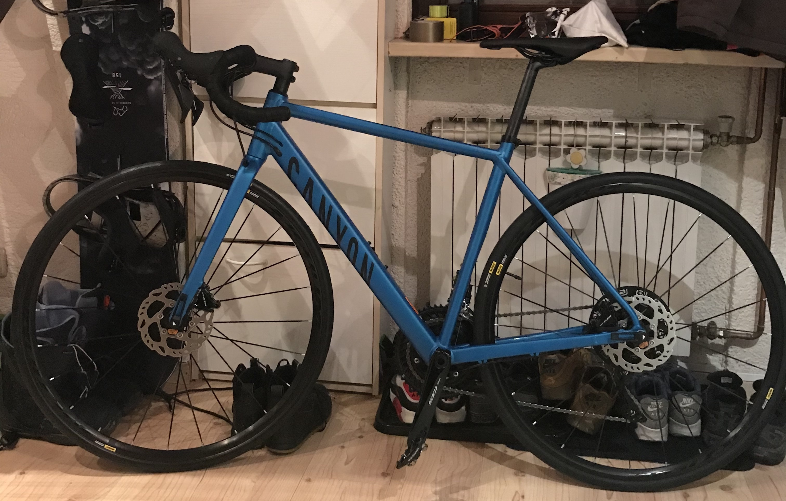
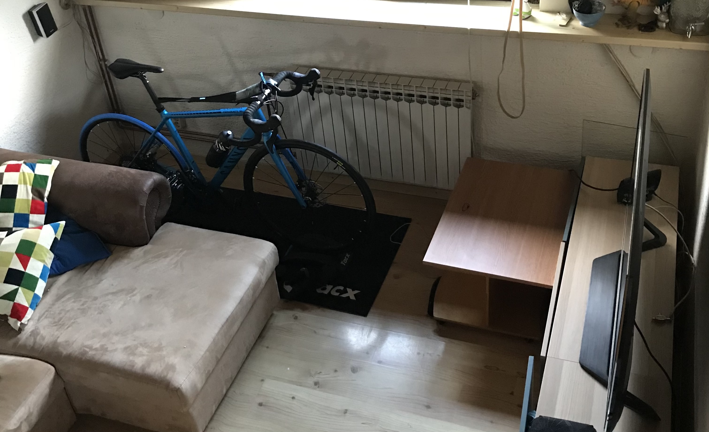

Preparations for the next bike season have finally begun. 
A few weeks back I bought a new bike, a [Canyon Endurace 8.0 AL](https://www.canyon.com/en-hr/road/endurace/2019/endurace-al-disc-7-0.html). I absolutely love it and can't wait to get it out and do some climbs on Sljeme. 🚴

But until then we need to "improvise", and the improvisation is called [Zwift](https://zwift.com/)!

I never thought about indoor cycling but I  saw some YouTubers doing it([Paul The Punter](https://www.youtube.com/channel/UCd_xQRiSE1Y7DUU03FpQMHQ), [Juliet Elliott](https://www.youtube.com/channel/UCjcANXkXDbYqQ34F_UTql5w)) and it looked pretty cool, so I said let's give it a try..

So I bought a home trainer Tacx [Satori](https://tacx.com/product/satori-smart/)(I fucked up I thought I was buying Tacx [Flow](https://tacx.com/product/flow-smart/), but ok I'm still happy with the results) and gave it a try. And man was I impressed, it's so cool, engaging and adictive(give me moooore). 

I never did more killometers in a single week(ok, I was mostly mountain biking but still) and never thought that indoor biking could be such fun. All in all im super excited and happy I started Zwifting and cant wait to see the progress I made on the trailis in spring! ❤️

This week I did my FTP test and its **213W**. Also, I started a 10 weeks training program that should improve my FTP but I will keep you posted about that. 📈

<strava url="https://www.strava.com/activities/2109455822/embed/ee01544cd5cc72b13abcf126158b6764e2b9953c"></strava>

