## Im selling my snowboard to buy a new one for the next session if your interested just send me an email to dino@reactor.studio

Last April I started snowboarding and I immediately fell in love with it ❤️. My first snowboarding steps were done on a local mountain called [Sljeme](https://www.sljeme.hr/) 🏔 ️ but during this year I also visited other places(most of them several times) some of them are Krvavec, Gerlitzen, Bad Kleinkirchheim, Nassfeld, Turracher Höhe. 

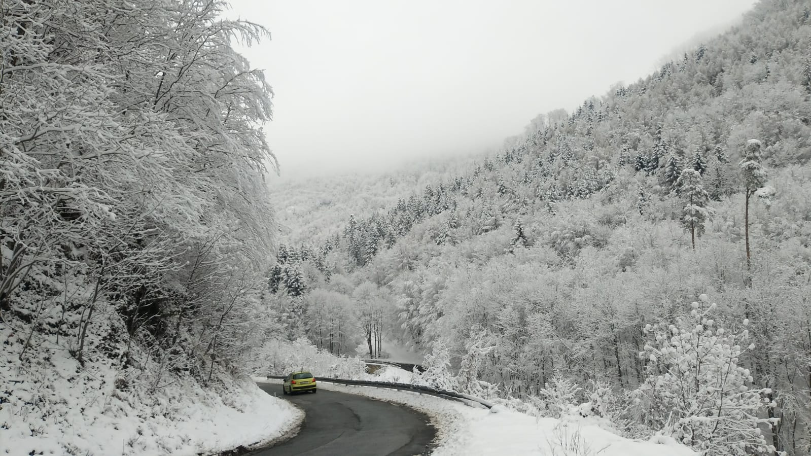
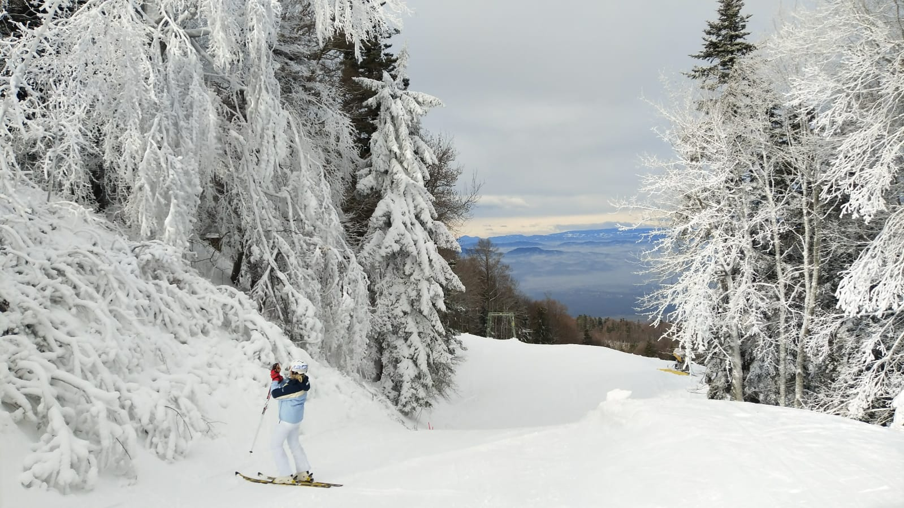
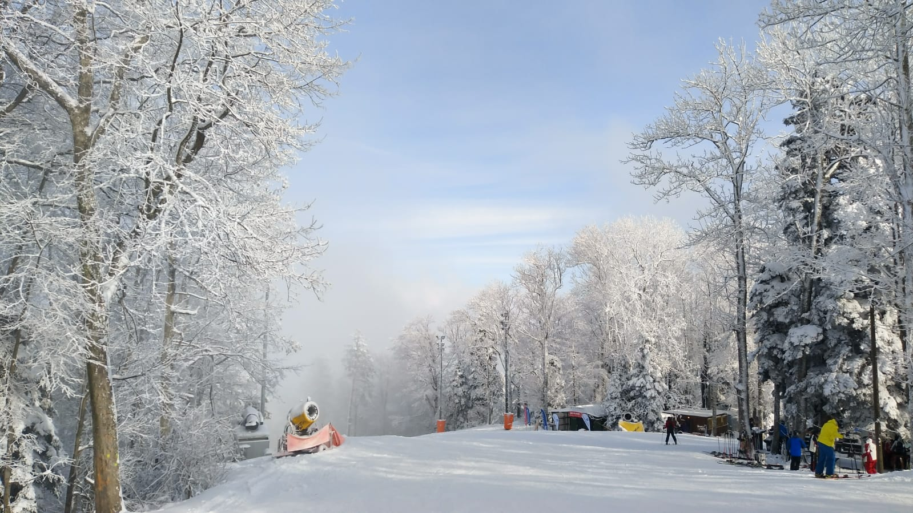
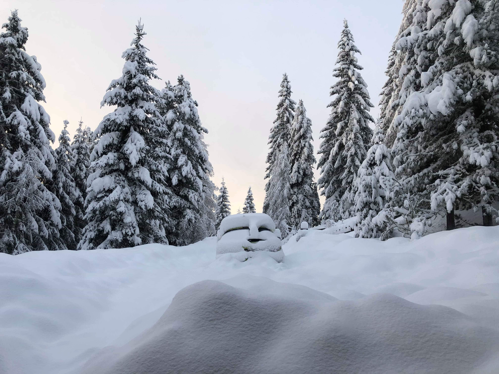

My snowboarding progressed a lot during this 1 year period, from not knowing how to stand on a snowboard 🤫 to doing some off-piste runs 💪 (I'm most happy about this part because as my snowboarding progresses I really want to get more into the off-piste stuff). 

## TODO: More of the off-piste stuff 🏂

I absolutely loved and all the trips I did with my friends. 

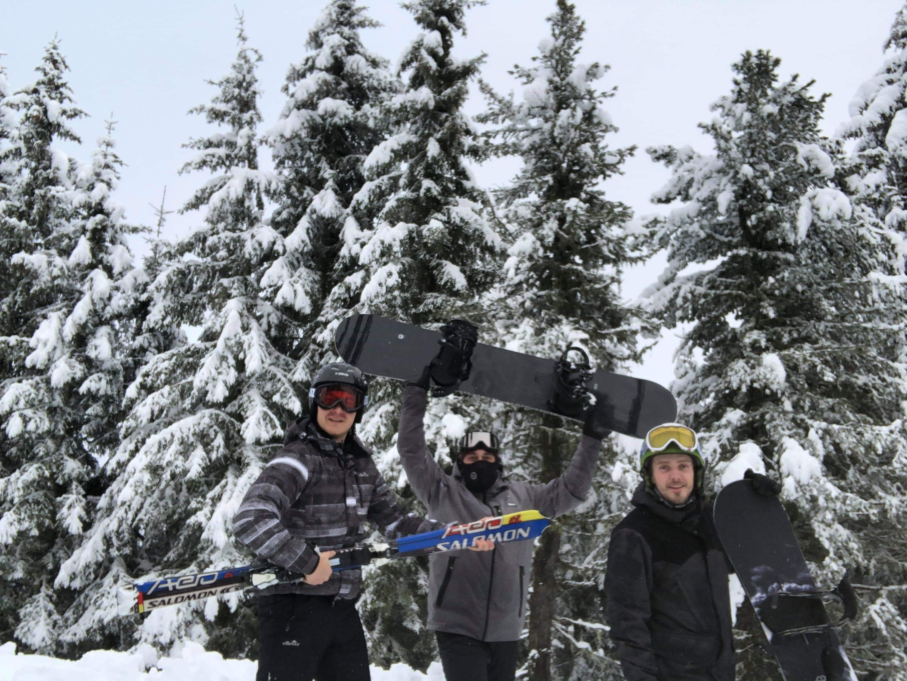
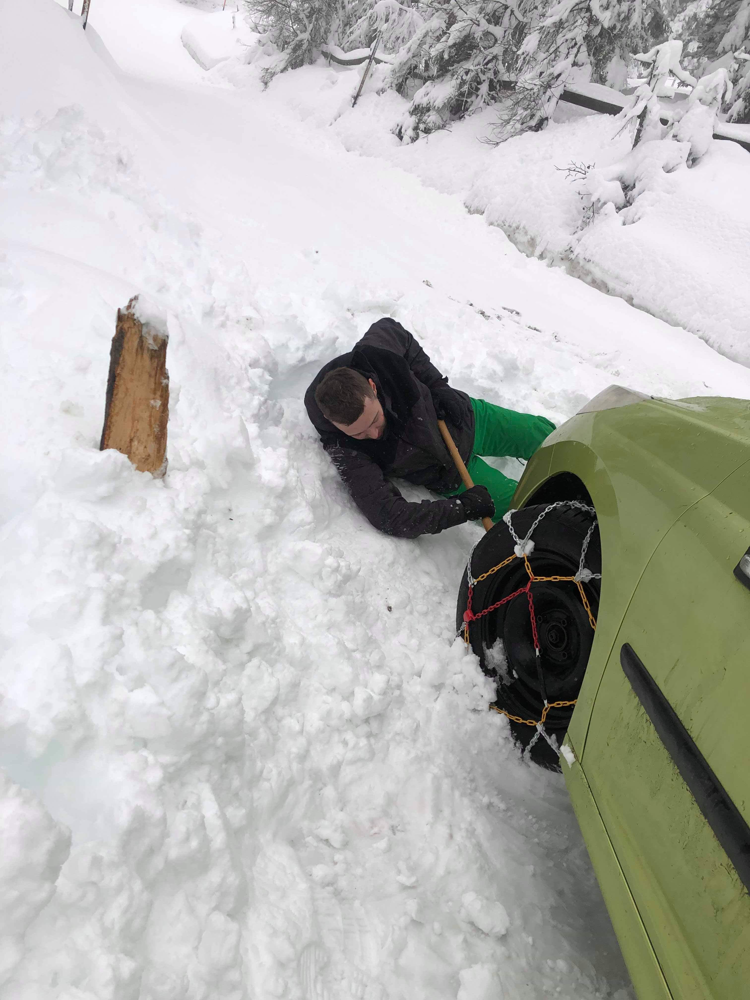
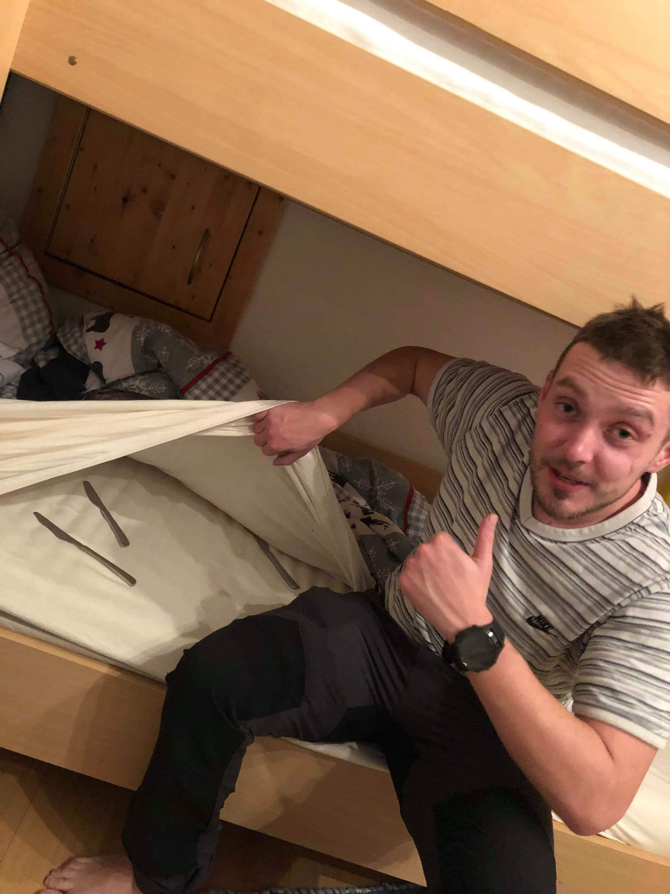

As snow season is coming to an end I will mostly be focusing on improving my bike skill 🚵 but can't wait for the next snowboarding session and some new adventures (I definitely need to visit St.Anton and Val Thorens). But until then here are some pictures from this snowboard session.

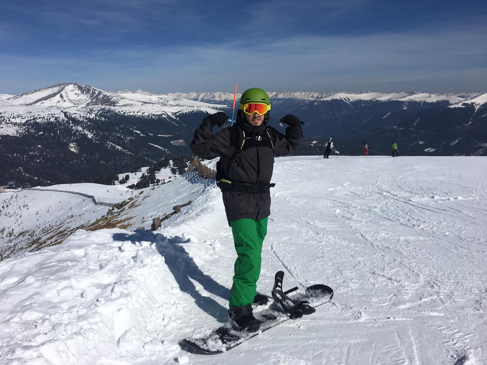
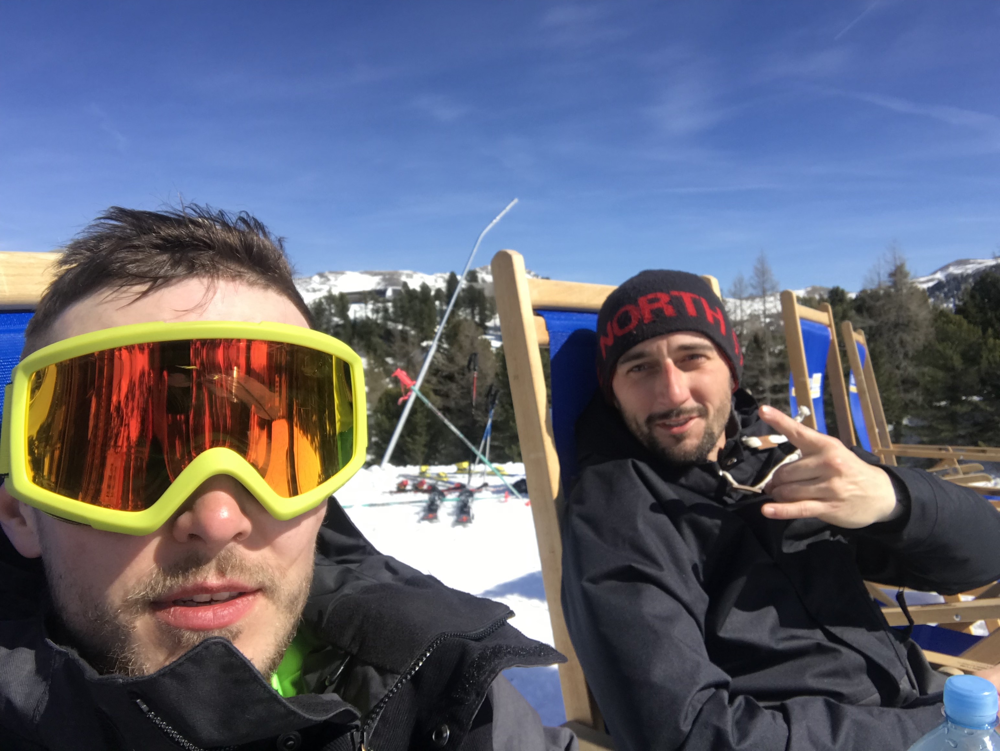
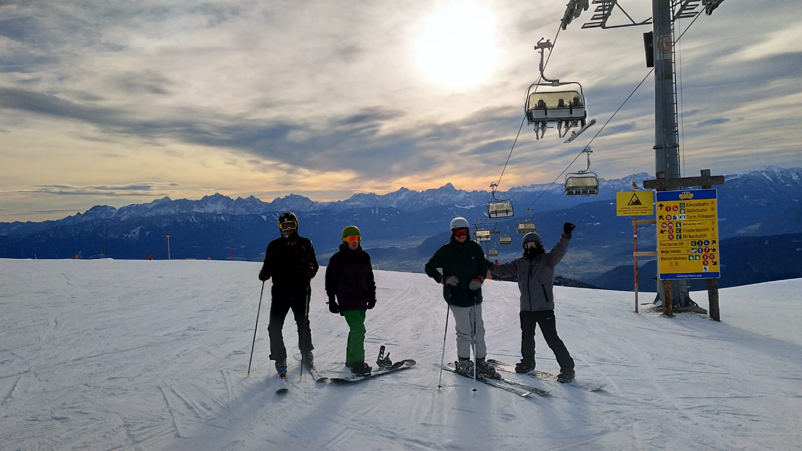
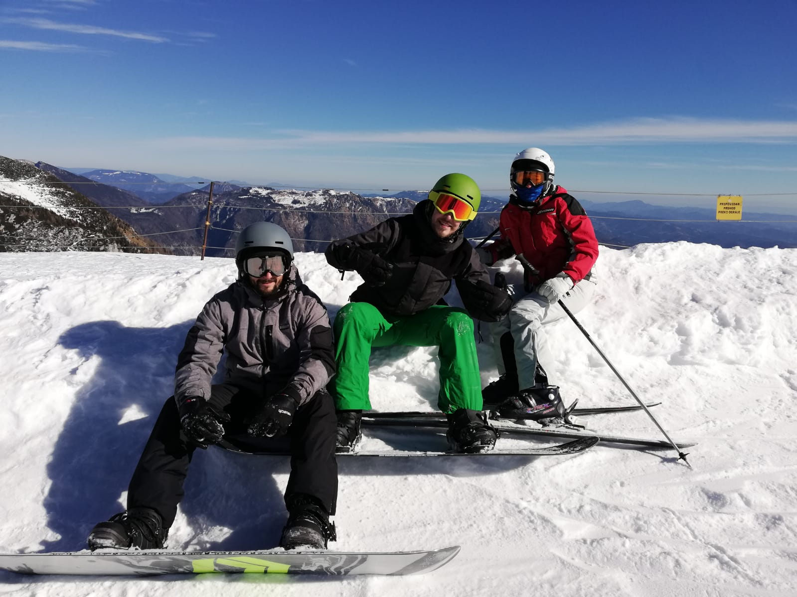
