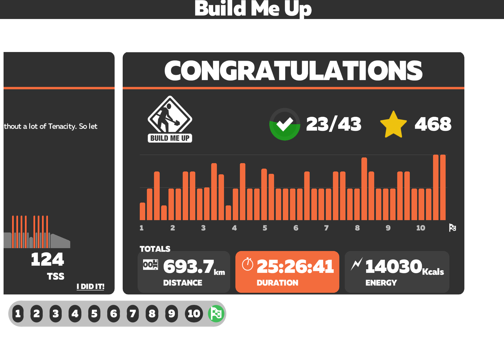

As you could read in the [previous article](https://www.dinodsaur.us/zwifting) for this winter session I bought a smart trainer and started doing some training over the winter. 

I followed a 10 week long zwift training plan called [Build me up](https://whatsonzwift.com/workouts/build-me-up/). Ok, I missed a few pieces of training because of the work-related trips and also last 2 weeks I did outdoor mountain biking. I think I did an average of 4 hours of biking a week.

## My new FTP is 242W 🎉

Over that period I did around **700km** and burned over **14000 calories**. And most importantly increased my FTP from **213W** to **242W**. 

This was part of my Let's get ready for the 2019 session because I will attend my first bike race ever and also the [Gony Pony](https://www.redbull.com/si-sl/events/goni-pony-dogodek) event that will happen in Slovenia.

I'm really looking forward to this year's bike session. I have some big plans and also I bought a GoPro7 so you will be able to go along the journey with me 😉
